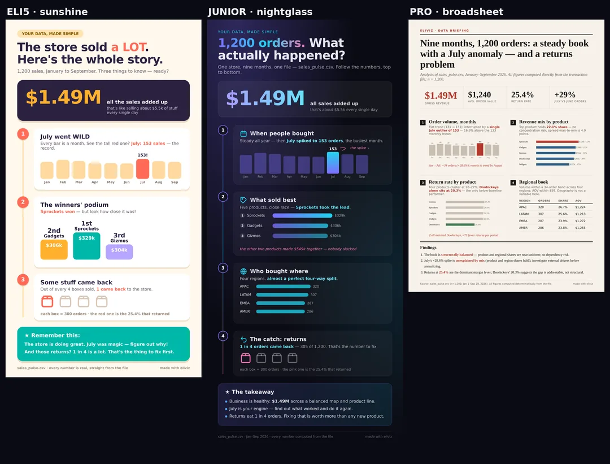
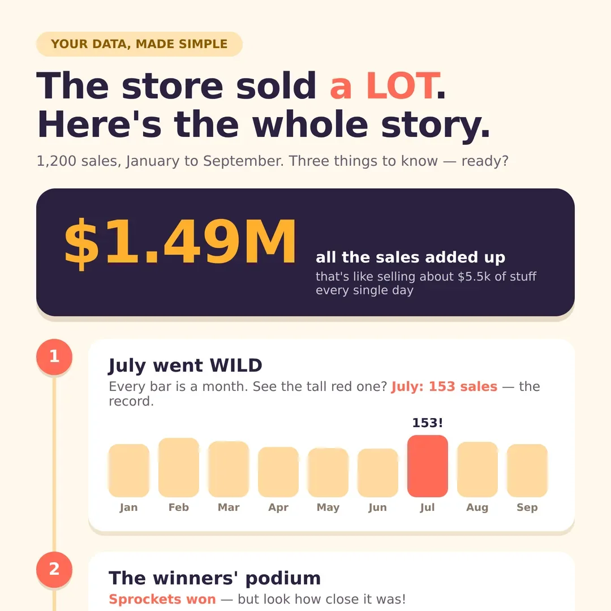
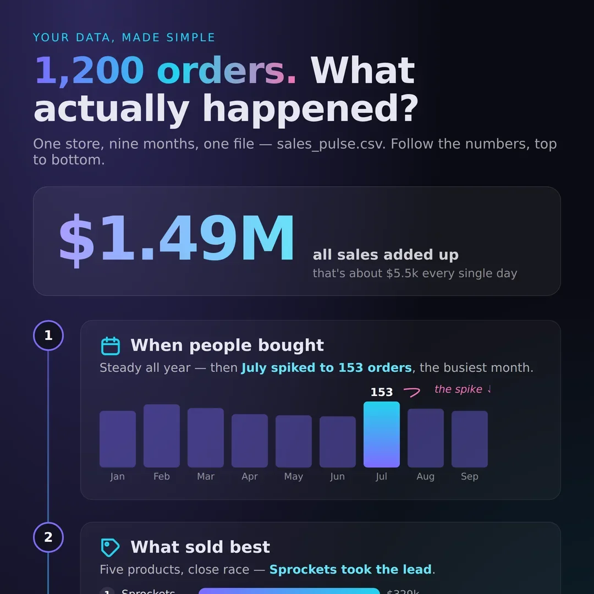
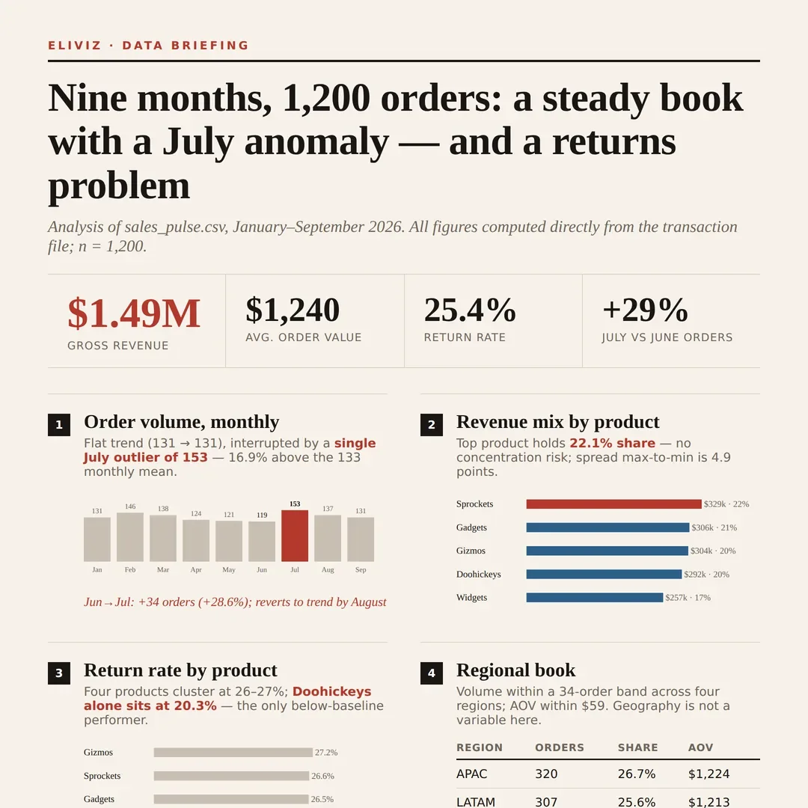
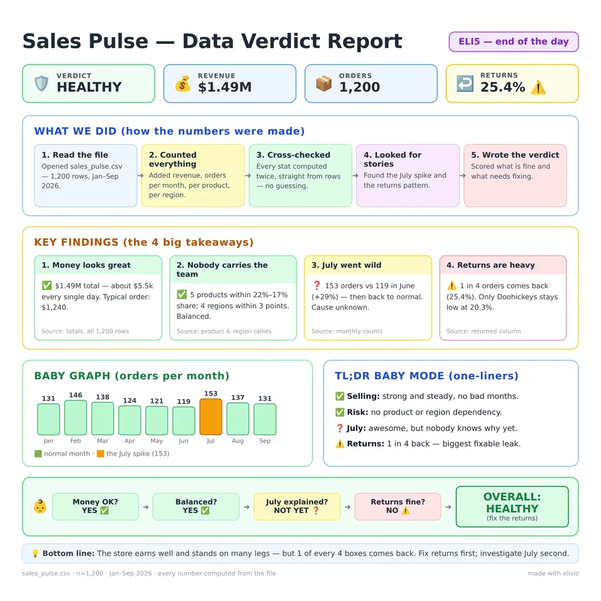

<div align="center">


<p>


<a href="https://code.claude.com/docs/en/plugins"></a>
</p>

[](https://www.claudepluginhub.com/plugins/costiash-eliviz?ref=badge)

<p><b>Install in Claude Code — two commands:</b></p>

</div>

```
/plugin marketplace add costiash/eliviz
/plugin install eliviz@eliviz
```

You have a CSV, a log file, a SQLite database, a Markdown report. Someone needs to *see* it — not in a spreadsheet, not in `less`, but as something you'd actually present. eliviz turns any of those files into one polished, interactive HTML page: animated hero, live stat counters, charts, profiled tables. One file you can email, drop in Slack, or open from a USB stick — no server, no internet required.

New in 1.1: a second output path — **static infographics**. Ask for "an infographic" or "an image I can share" and eliviz composes a real data story (hero stat, numbered reading path, pictograms, annotations, takeaway) and renders it to a PNG, with the editable HTML source alongside. Three complexity levels — `eli5`, `junior`, `pro` — because a poster for your kid and a briefing for your board are different artifacts.

## 📦 Installation

Run these two commands in Claude Code:

```
/plugin marketplace add costiash/eliviz
/plugin install eliviz@eliviz
```

That's it — no other setup. Python's standard library handles parsing; see [Requirements & license](#-requirements--license) for the two optional extras (Excel input, infographic PNG rendering).

## 💬 Usage

Just ask. Examples:

| What you say | What you get |
|---|---|
| "Visualize this CSV" | Auto-profiled interactive page with charts, counters, and a sortable table |
| "Make a viewer for these logs" | Level-filterable log viewer, built for scanning |
| "Turn this report into a page for the board" | Polished document page with outline navigation |
| "Visualize this in our brand colors: #0a2540 and gold" | Custom design pack in your palette, contrast-verified |
| "I want the editorial layout but dark" | A blend — editorial structure, dark treatment |
| "Make an infographic of this sales data" | A static data-story PNG (plus its HTML source) with a hero stat and numbered reading path |
| "A one-pager my interns will actually read" | The same story at `eli5` level — pictograms, one idea per card |
| "A briefing image for the exec review" | `pro` level — dense modules, findings block, formal source line |

## 🧒 The ELI5 voice — where the name comes from

**eliviz = ELI5 + viz.** What makes it unique isn't the charts — it's the words around them. Every page speaks in a mandatory plain-English voice (`[MODE: ELI5_FOR_DUMMIES]`, baked verbatim into the skill): a smart 10-year-old could read any label on the page and get it.

So instead of dashboard jargon, generated pages say things like:

> "One row = one record" · "A column is like a labeled jar — click it to peek inside" · "A log is a diary your software writes" · "Errors: things that broke" · "Dig in — like folders inside folders"

The hero opens with *"Your data, made simple"* and defaults to *"A simple tour of X. No jargon."* The voice is enforced end to end: it's a required section in the skill, an item in the output-expectations checklist, a note in the design spec so template edits keep it, and a guardrail in the design-adapter agent — every generated page complies out of the box.

One deliberate boundary: the rule covers the **page's own words only**. Your data — column names, cell values, log lines — is never rewritten.

## 🎨 Design bank

Five identities ship in the bank. eliviz picks one based on your data and how you phrase the request, or you choose with `--design <id>`. Same dataset ("Q1–Q3 Sales Pulse"), five looks — plus a peek inside the page body:

<table>
  <tr>
    <th width="50%" align="center">🌌 aurora — dark glass, particle-wave hero <i>(default)</i></th>
    <th width="50%" align="center">📰 editorial — warm paper, serif type</th>
  </tr>
  <tr>
    <td align="center"></td>
    <td align="center"></td>
  </tr>
  <tr>
    <th align="center">⬛ brutalist — hard borders, offset shadows</th>
    <th align="center">🖥️ terminal — phosphor CRT, code-rain hero</th>
  </tr>
  <tr>
    <td align="center"></td>
    <td align="center"></td>
  </tr>
  <tr>
    <th align="center">🌆 neon — cyberpunk glow, synthwave-grid hero</th>
    <th align="center">🔍 inside every page — columns profiled</th>
  </tr>
  <tr>
    <td align="center"></td>
    <td align="center"></td>
  </tr>
</table>

<p align="center"><i>Bottom-right: the page body — every column profiled, types detected, distributions drawn. "A column is like a labeled jar."</i></p>

Want something off-menu? The design-adapter agent builds custom packs — your brand colors, a mood, or a blend of bank styles — and screenshot-verifies contrast before handing the page back.

## 🖼️ Infographics — static data stories *(new in 1.1)*

Not every audience wants an interactive page. The `infographic` skill turns the same data files into **shareable images**: composed as HTML/SVG, rendered to PNG with headless Chromium — no image-generation APIs, fully offline, and every number on the canvas is computed deterministically from your file (the narrative agent selects numbers; it never invents or computes them).

The complexity **level** is chosen first, because a 10-year-old's explainer and a board briefing are different artifacts — same dataset, three registers:

<p align="center"></p>

<table>
  <tr>
    <th width="25%" align="center">🧒 eli5 · sunshine</th>
    <th width="25%" align="center">🌃 junior · nightglass</th>
    <th width="25%" align="center">📊 pro · broadsheet</th>
    <th width="25%" align="center">🛡️ verdict-card</th>
  </tr>
  <tr>
    <td align="center"><a href="docs/shots/infographic-sunshine.webp"></a></td>
    <td align="center"><a href="docs/shots/infographic-nightglass.webp"></a></td>
    <td align="center"><a href="docs/shots/infographic-broadsheet.webp"></a></td>
    <td align="center"><a href="docs/shots/infographic-verdict.webp"></a></td>
  </tr>
  <tr>
    <td align="center"><sub>pictograms, one idea per card</sub></td>
    <td align="center"><sub>the clean-modern default</sub></td>
    <td align="center"><sub>data-journalism briefing</sub></td>
    <td align="center"><sub>the "report-card" grid</sub></td>
  </tr>
</table>

<p align="center"><i>Click any card to open the full live version — each one is the real, self-contained HTML the PNG is rendered from.</i></p>

Under the hood: six layout templates (journey-spine, verdict-card, broadsheet-brief, bento-grid, badge-map, neon-blueprint), a level-keyed design bank, and an `infographic-director` agent that writes the story brief from the parser's numbers. Rules that never bend: one hero stat, a single numbered reading path, fixed color semantics (green=pass, amber=caution, red=risk), a source strip on every canvas — and you always get **both** the PNG and its editable HTML source.

## ✨ Features

- **ELI5 voice** — all page copy passes the "smart 10-year-old" test; your data itself is never touched
- **Any input** — CSV, TSV, Excel, SQLite, JSON/JSONL, Markdown, plain text, logs
- **One file out** — GSAP, three.js, and Tailwind inlined; fully offline-capable (`--cdn` for smaller files)
- **Animated hero** — three.js particle field with GSAP-driven entrance
- **Stat counters & SVG charts** — key numbers animate in, charts built from your actual data
- **Column-profiled tables** — sortable, with per-column type detection and distribution cards
- **Outline reading view** — Markdown and text documents become navigable pages
- **Log viewer** — level-filterable, built for scanning
- **Deterministic parsing** — bundled Python, stdlib only (openpyxl needed just for Excel)
- **Five design identities** — auto-picked per dataset, or forced with `--design <id>`
- **Design-adapter agent** — custom packs from brand colors, moods, or blends of bank styles, screenshot-verified for contrast before delivery
- **Static infographics** *(new)* — real data stories rendered to PNG + editable HTML, three complexity levels, level-keyed style packs, six layout templates
- **Infographic-director agent** *(new)* — writes the narrative brief; every number copied verbatim from the parser, never computed downstream

## ⚙️ How it works

One bundled Python parser (stdlib only, shared by both skills) reads your file deterministically and profiles every column — including group-by aggregates, so no number is ever computed by a language model. For **pages**, Claude composes the interactive HTML around a design identity from the bank. For **infographics**, the `infographic-director` agent writes a story brief from the parser's numbers, Claude composes the poster from a layout template and a level-keyed style pack, and headless Chromium renders it to PNG at measured height.

## ▶️ Live demos

**Click, don't clone:** everything below is live on GitHub Pages, rendered from the same demo dataset.

Interactive report, five designs:

| | | | | |
|---|---|---|---|---|
| [🌌 aurora](https://costiash.github.io/eliviz/demos/aurora.html) | [📰 editorial](https://costiash.github.io/eliviz/demos/editorial.html) | [⬛ brutalist](https://costiash.github.io/eliviz/demos/brutalist.html) | [🖥️ terminal](https://costiash.github.io/eliviz/demos/terminal.html) | [🌆 neon](https://costiash.github.io/eliviz/demos/neon.html) |

Infographics, three levels + one template showcase:

| | | | |
|---|---|---|---|
| [🧒 sunshine (eli5)](https://costiash.github.io/eliviz/demos/infographics/sunshine.html) | [🌃 nightglass (junior)](https://costiash.github.io/eliviz/demos/infographics/nightglass.html) | [📊 broadsheet (pro)](https://costiash.github.io/eliviz/demos/infographics/broadsheet.html) | [🛡️ verdict-card](https://costiash.github.io/eliviz/demos/infographics/verdict-card.html) |

or browse them from the [demo gallery](https://costiash.github.io/eliviz/). Prefer the fully-offline single-file versions (all libraries inlined, ~1.6 MB each)? They're attached to the [latest release](https://github.com/costiash/eliviz/releases/latest) — download one, open it anywhere, no internet needed.

## 📄 Requirements & license

- **Python** for parsing — standard library only; `openpyxl` is needed only for Excel files; `playwright` (plus `python -m playwright install chromium`) is needed only for infographic PNG rendering.
- **MIT licensed.** Generated pages inline vendored libraries under their own terms: [GSAP](https://gsap.com/community/standard-license/) (standard license), [three.js](https://github.com/mrdoob/three.js) (MIT), [Tailwind CSS](https://github.com/tailwindlabs/tailwindcss) (MIT).
